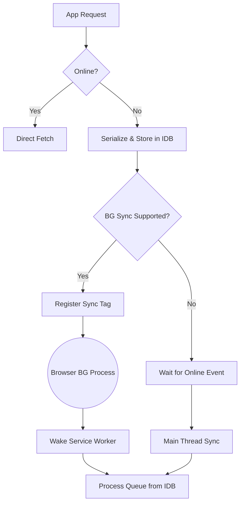

# 🚀 rest-sync-lite

> **Zero-Dependency, Offline-First REST API Synchronization Engine.**

[](https://opensource.org/licenses/MIT)
[](https://www.typescriptlang.org/)

**rest-sync-lite** is a lightweight TypeScript library designed to make your web applications resilient to network issues. It intercepts API calls when the user is offline, persists them securely using IndexedDB, and automatically synchronizes them when the connection is restored.

Perfect for **Mobile Web Apps**, **PWAs**, **Field Service Apps**, and Enterprise Dashboards that cannot afford data loss.

---

<p align="center">
  <a href="https://mircdj.github.io/rest-sync-lite/">
    
  </a>
  <br>
  <b>Check out the <a href="https://mircdj.github.io/rest-sync-lite/">Interactive Playground</a> to see Background Sync and Offline Simulator in action!</b>
</p>

---

## ✨ Key Features

*   📦 **Zero Runtime Dependencies:** Written in pure native TypeScript. No bloat (no `axios`, `lodash`, `idb`).
*   💾 **IndexedDB Powered:** Uses the browser's native database to store large queues that survive page refreshes or device restarts.
*   🔄 **FIFO Queue & Sequential Processing:** Guarantees that requests are executed strictly in the order they were created.
*   🛡️ **Smart Retry Policy:** Exponential backoff to handle server overloads (5xx) and intelligent handling of fatal errors (4xx).
*   🔐 **Auth-Aware:** Supports automatic session refreshing if a token expires (401) during synchronization.
*   ⚛️ **React Ready:** Built-in hooks for real-time connection and sync status monitoring.
*   📂 **File Support:** Native support for persistent `Blob`, `File`, and `FormData` uploads.
*   ⚡️ **Priority Queue:** Prioritize critical requests (`high`) over background tasks (`low`).
*   🚫 **Cancellable:** Cancel queued requests on demand.
*   📡 **PWA & Background Sync:** Fully integrated with the **Web Background Sync API** to finish uploads even after the browser is closed.
*   🔔 **Event-Driven UI:** Seamlessly integrates with toast notifications and UI feedback via a unified event system.
*   🚀 **Production Ready Demo:** A professional playground to test complex offline scenarios and binary uploads.
*   🌐 **Framework Agnostic:** Works seamlessly with Angular, Vue, Svelte, or Vanilla JS.

---

## 📦 Installation

```bash
npm install rest-sync-lite
# or
yarn add rest-sync-lite
```

---

## 🚀 Quick Start

### 1. Initialization

Create a singleton instance of the library.

```typescript
import { RestSyncLite } from 'rest-sync-lite';

export const apiSync = new RestSyncLite({
  dbName: 'MyAppSyncDB',
  maxRetries: 3,
  // Optional: Function to refresh token if a 401 occurs during sync
  refreshToken: async () => {
    await myAuthService.refreshSession();
  }
});
```

### 2. Usage in your App

Replace your native `fetch` calls with `apiSync.fetch`. The signature is identical to `window.fetch`.

## 🎮 Interactive Playground

We've built a "Killer Demo" to showcase what `rest-sync-lite` can do. It's a full PWA that demonstrates:

*   **Network Simulation**: Toggle "Simulate Offline" to queue requests without disconnecting your Wi-Fi.
*   **Real-time Monitoring**: Watch the queue grow and drain in real-time.
*   **Background Sync**: Queue a request, close the tab, and watch it sync when you reopen (Service Worker magic).

👉 **[Try the Live Demo](https://mircdj.github.io/rest-sync-lite/)** or run it locally:

```bash
cd playground
npm install
npm run dev
```

```typescript
// Example 1: Saving a form (Simple JSON)
async function saveOrder(orderData: any) {
  try {
    const response = await apiSync.fetch('https://api.example.com/v1/orders', {
      method: 'POST',
      headers: { 'Content-Type': 'application/json' },
      body: JSON.stringify(orderData),
      priority: 'high' // ⚡️ Urgent request (v1.2.0+)
    });
    // ...
  } catch (error) {
    console.error('Request failed:', error);
  }
}

// Example 2: File Uploads (Blob / FormData) (v1.2.0+)
async function uploadAvatar(file: File) {
  const formData = new FormData();
  formData.append('avatar', file);

  // Files are automatically stored in IndexedDB and retried properly!
  await apiSync.fetch('https://api.example.com/v1/profile/avatar', {
      method: 'POST',
      body: formData,
      // No Content-Type header needed for FormData, let browser handle boundary
  });
}

// Example 3: Cancellable Requests (v1.2.0+)
async function syncDataWithCancel() {
    const customId = 'my-sync-job-123';
    
    // Pass a custom ID (optional)
    await apiSync.fetch('https://api.example.com/v1/sync', {
        method: 'POST',
        id: customId, 
        priority: 'low'
    });

    // ... later if user cancels ...
    await apiSync.cancelRequest(customId);
}
```

### Advanced Usage

#### Priority Queue ⚡️
You can specify the priority of a request using the `priority` option. Requests are processed in this order:
1. `high`
2. `normal` (default)
3. `low`

```typescript
apiSync.fetch('/api/logs', { method: 'POST', body: logs, priority: 'low' });
apiSync.fetch('/api/alert', { method: 'POST', body: alert, priority: 'high' });
```

#### Cancellable Requests & Custom IDs 🚫
You can assign a custom ID to a request to track or cancel it later.

```typescript
// 1. Enqueue with ID
const response = await apiSync.fetch('/api/job', { id: 'job-123' });

// 2. Cancel it (removes from Queue / DB)
const cancelled = await apiSync.cancelRequest('job-123');
if (cancelled) console.log('Request cancelled!');
```


### 3. Usage with React

**rest-sync-lite** provides a built-in hook to make your UI reactive to network capability and sync status.

```tsx
import { RestSyncLite } from '@mircdj/rest-sync-lite';
import { useRestSync } from '@mircdj/rest-sync-lite/react';

// Recommended: Initialize singleton in a separate file (e.g., api.ts)
const apiSync = new RestSyncLite({ /* config */ });

function StatusBadge() {
  // ⚡️ Automatically re-renders when online/offline or syncing changes
  const { isOnline, isSyncing, queueSize } = useRestSync(apiSync);

  return (
    <div className={`badge ${isOnline ? 'online' : 'offline'}`}>
      {isOnline ? 'ONLINE' : 'OFFLINE'}
      {isSyncing && <span> (Syncing...)</span>}
      {queueSize > 0 && <span className="counter">{queueSize} Pending</span>}
    </div>
  );
}
```

### 4. Background Synchronization (PWA Support) 📡

**rest-sync-lite** supports the [Web Background Sync API](https://developer.mozilla.org/en-US/docs/Web/API/Background_Synchronization_API). This allows your app to synchronize data even if the user closes the tab or the browser, as soon as the connectivity is restored.

#### Step 1: Register the Service Worker helper
In your `service-worker.js` (or `sw.ts`), import and initialize the background sync listener:

```javascript
// In your service-worker.js
import { initRestSyncServiceWorker } from 'rest-sync-lite/sw';

initRestSyncServiceWorker({
  maxRetries: 10, // You can use a different config for background sync
  // Important: refreshToken logic in SW must not use DOM APIs (window/document)
  refreshToken: async () => {
     /* background-safe auth logic */
  }
});
```

#### Step 2: How it works
The library automatically detects if the browser supports BackgroundSync.

*   **Chrome/Edge/Android:** If the user is offline, it registers a sync tag. The browser will "wake up" your Service Worker to send the data even if the site is closed.
*   **Safari/Firefox:** Since they don't support the Background Sync API yet, the library gracefully falls back to standard synchronization as soon as the app is reopened.

### 5. Events

You can force a synchronization manually if needed (e.g., when the user clicks a "Sync Now" button), although the library listens for online events automatically.

```typescript
await apiSync.syncNow();
```

---

## 📖 API Reference

### Core Methods

| Method | Returns | Description |
| :--- | :--- | :--- |
| `fetch(input, init?)` | `Promise<Response>` | Drop-in replacement for native `fetch`. Queues if offline. |
| `syncNow()` | `Promise<void>` | Manually triggers synchronization of all pending requests. |
| `cancelRequest(id)` | `Promise<boolean>` | Cancels a pending request by its ID. Returns `true` if found and removed. |
| `getQueueItems()` | `Promise<RequestItem[]>` | Returns all pending requests in the queue. Useful for UI visualization. |

### Properties (via React Hook or direct access)

| Property | Type | Description |
| :--- | :--- | :--- |
| `isOnline` | `boolean` | Current network status. |
| `isSyncing` | `boolean` | Whether the sync engine is currently processing the queue. |
| `queueSize` | `number` | Number of pending requests in the queue. |

### Events

Listen to events using `apiSync.events.on('eventName', callback)`.

| Event | Payload Type | Description |
| :--- | :--- | :--- |
| `network:change` | `boolean` | Triggered when network status changes (true=online). |
| `queue:update` | `void` | Fired when queue size changes (enqueue/dequeue). |
| `sync:start` | `void` | Synchronization process started. |
| `sync:end` | `void` | Synchronization process finished. |
| `request-success` | `{ id, response, item }` | A queued request was sent successfully. `item` contains original request data. |
| `request-error` | `{ id, error, permanent, item }` | A queued request failed. `permanent` is true if max retries exceeded. |
| `request:cancelled` | `string` (id) | A request was manually cancelled. |

### Example: Queue Visualization

```typescript
// Display all pending requests in your UI
const pendingRequests = await apiSync.getQueueItems();

pendingRequests.forEach(req => {
  console.log(`[${req.priority}] ${req.method} ${req.url} - Retries: ${req.retryCount}`);
});
```

---

## ⚙️ Configuration

The `RestSyncLite` constructor accepts a configuration object:

| Option | Type | Default | Description |
| :--- | :--- | :--- | :--- |
| `dbName` | `string` | `'rest-sync-lite'` | The name of the IndexedDB database. |
| `maxRetries` | `number` | `5` | Max recursion attempts for 5xx/Network errors before giving up. |
| `refreshToken` | `() => Promise<void>` | `undefined` | Async callback to execute if the sync engine encounters a 401 error. |

---

## 🛠️ Architecture

**rest-sync-lite** acts as a proxy between your app and the network:

1.  **Intercept**: The request is analyzed.
2.  **Check**: If **ONLINE**, it attempts a direct send.
3.  **Fallback**: If **OFFLINE** or request fails (network error), it serializes the request.
4.  **Register (PWA)**: If supported, registers a **Background Sync** task for the Service Worker.
5.  **Persist**: The serialized request is stored in IndexedDB (Object Store).
6.  **Sync (Main Thread)**: A `NetworkWatcher` detects connection restoration and triggers the `SyncEngine`.
7.  **Sync (Background)**: The Browser wakes up the Service Worker to process the queue via `processQueueInBackground`.



---

## 🤝 Contributing

Pull Requests are welcome!

1.  Fork the repository
2.  Create your feature branch (`git checkout -b feature/AmazingFeature`)
3.  Commit your changes (`git commit -m 'Add some AmazingFeature'`)
4.  Push to the branch (`git push origin feature/AmazingFeature`)
5.  Open a Pull Request

---

## 📄 License

Distributed under the MIT License.

---

## 🗺️ Roadmap

We are constantly improving `rest-sync-lite`. Here is what's coming next:

- [ ] **Vue.js & Angular Wrappers**: First-class support for other popular frameworks.
- [ ] **SQLite / OPFS Adapters**: Alternative storage engines for extremely large datasets.
- [ ] **Compression**: Gzip/Brotli compression for synchronized payloads.